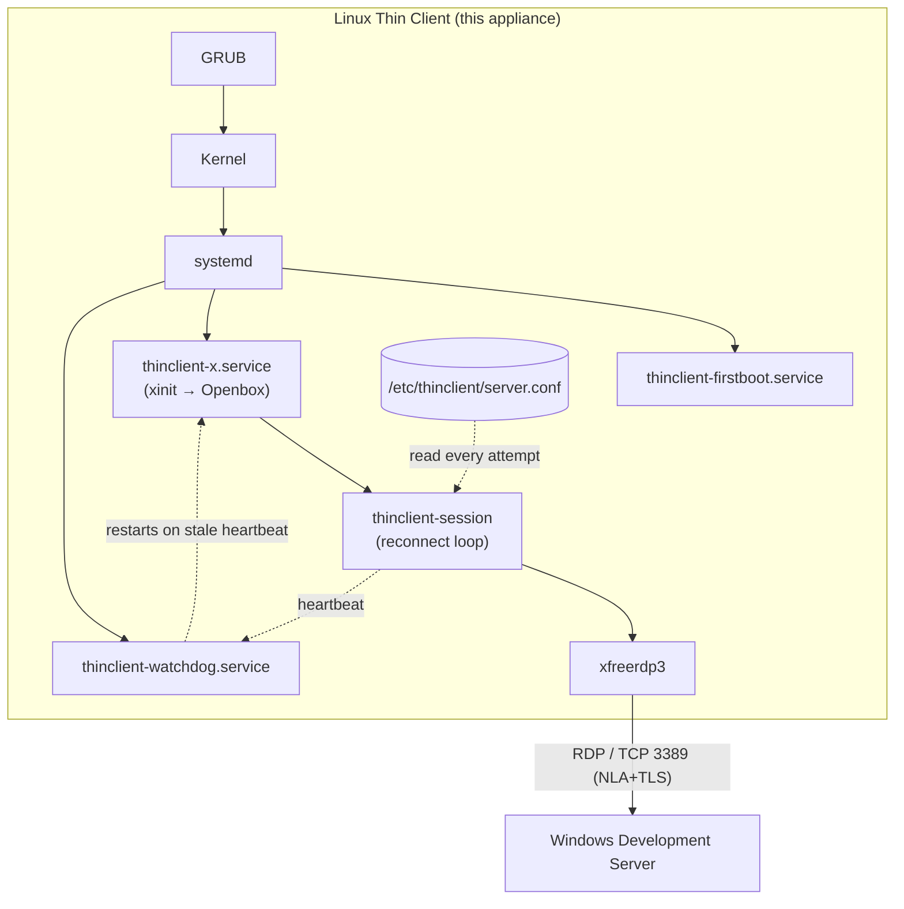
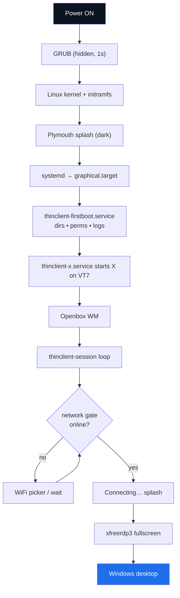
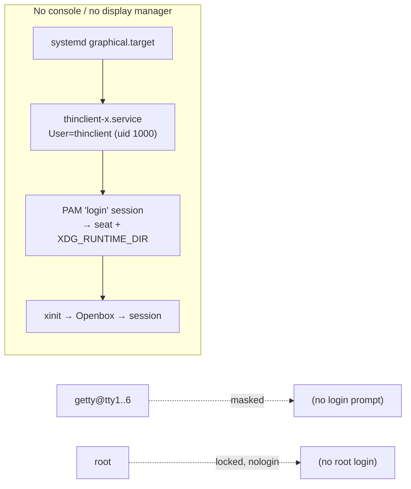
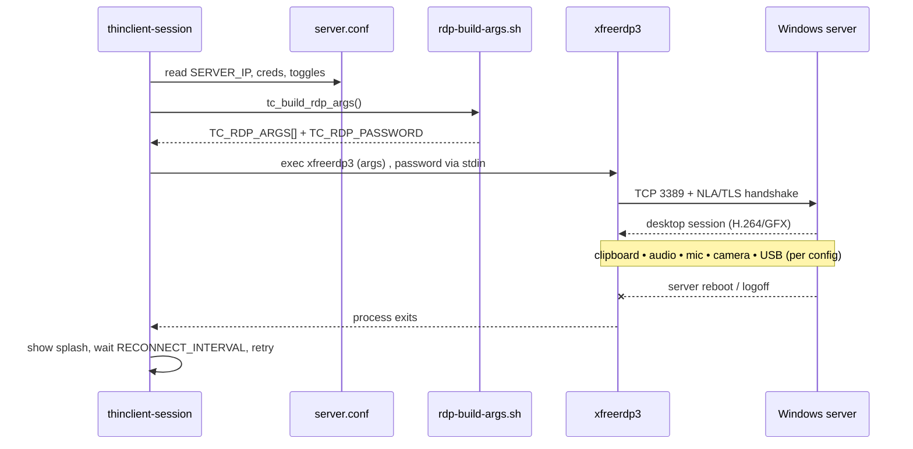
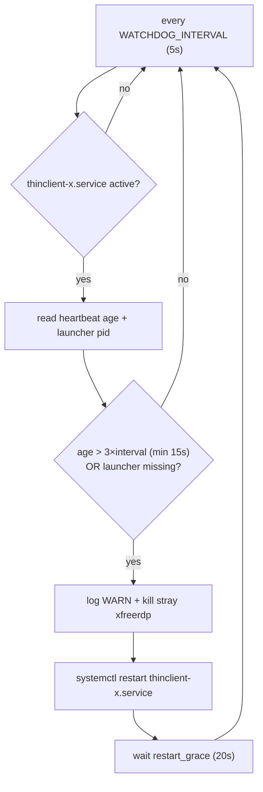
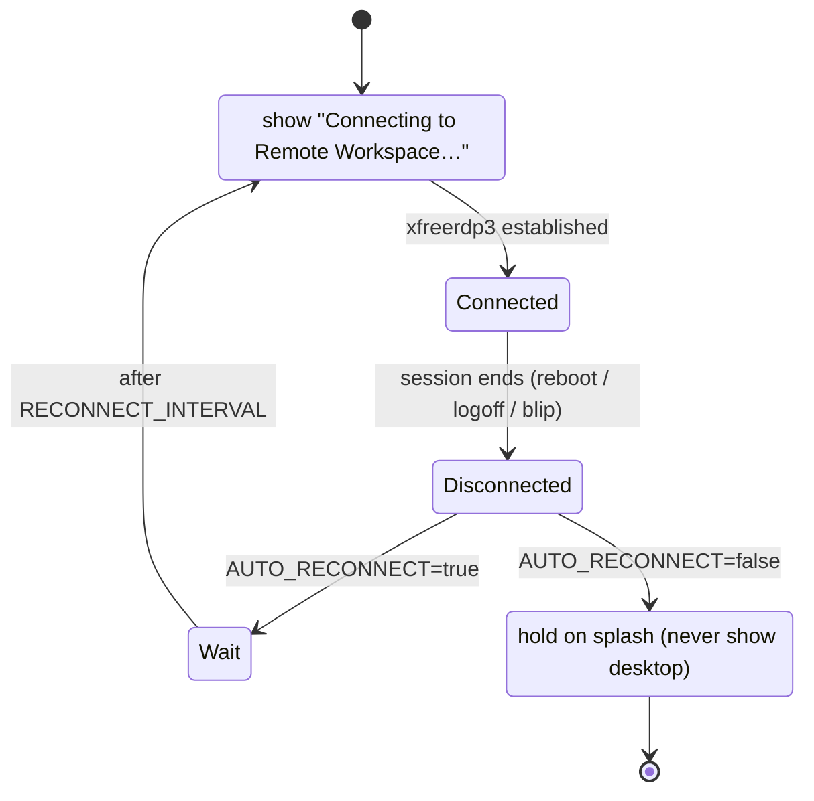
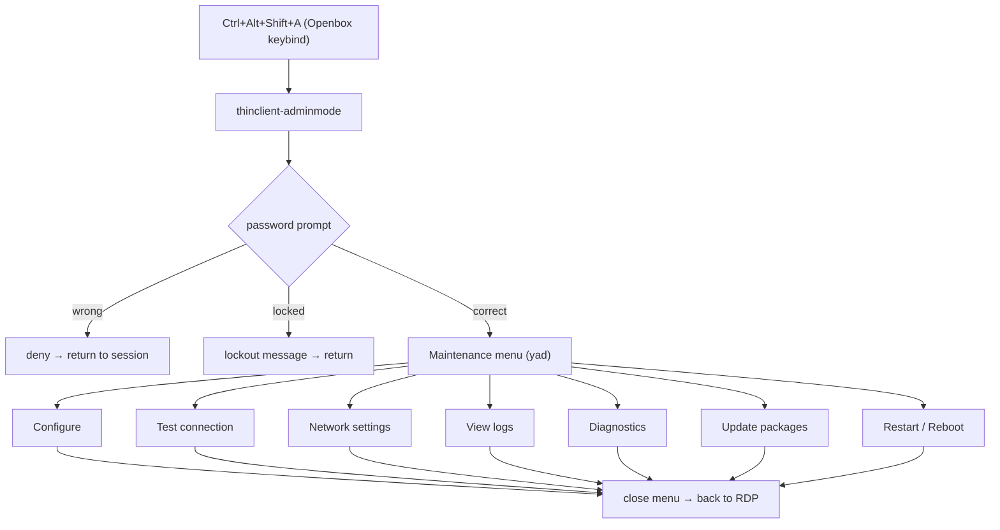

# Architecture

ThinClient OS is a single-purpose Debian 13 appliance. Its only job is to run a
full-screen FreeRDP session against a Windows server and keep it alive forever,
while never exposing any part of Linux to the user.

## Components

| Layer | Component | Role |
|---|---|---|
| Firmware | GRUB (BIOS + UEFI) | Boots the kernel silently |
| Boot UX | Plymouth (`thinclient` theme) | Dark splash; hides all boot text |
| Init | systemd (`graphical.target`) | Brings up exactly three services |
| Session | `thinclient-x.service` | Launches X on VT7 → Openbox → RDP loop |
| Reconnect | `thinclient-session` | Forever-loop that runs FreeRDP + splash |
| Network gate | `thinclient-netwait` + `thinclient-wifi` | Ensures a network before RDP; shows the locked-down WiFi picker when offline |
| RDP | `xfreerdp3` (FreeRDP 3) | The actual Windows connection |
| Supervisor | `thinclient-watchdog.service` | Restarts the session on a stale heartbeat |
| Prep | `thinclient-firstboot.service` | Dirs, permissions, log seeding |
| Config | `/etc/thinclient/server.conf` | The single source of truth |
| Admin | `thinclient-adminmode` (hotkey) | Password-gated maintenance |

Everything the appliance runs lives under `/opt/thinclient/` (`bin/`, `lib/`,
`share/`, `assets/`, `docs/`). Configuration lives under `/etc/thinclient/`.
Logs live under `/var/log/thinclient/`.

## Supervision model (three independent safety nets)

1. **FreeRDP `/auto-reconnect`** — recovers brief network blips *within* a session.
2. **`thinclient-session` loop** — if FreeRDP exits, re-launches it after
   `RECONNECT_INTERVAL`, showing the "Connecting…" splash in between.
3. **`thinclient-watchdog`** — if the whole session wedges (heartbeat goes
   stale), it `systemctl restart`s `thinclient-x.service`.
4. **systemd `Restart=always`** — if X itself dies, systemd relaunches it.

No single failure leaves the user looking at Linux.

---

## Diagram 1 — Overall architecture

## Diagram 2 — Boot process

## Diagram 3 — Login flow

## Diagram 4 — RDP flow

## Diagram 5 — Watchdog flow

## Diagram 6 — Auto-reconnect

## Diagram 7 — Admin mode

## Diagram 8 — Deployment process

```mermaid
flowchart LR
    A["build.sh / make iso"] --> B["thinclient.iso"]
    B --> C["dd → USB stick"]
    C --> D["Boot reference PC (live)"]
    D --> E["Admin → Configure server"]
    E --> F["thinclient-install /dev/sda"]
    F --> G["Reference machine boots from disk"]
    G --> H["Clonezilla: capture image"]
    H --> I["Clonezilla: restore to fleet (N machines)"]
    I --> J["Per-site: adjust server.conf if needed"]
```

See [CONFIGURATION.md](CONFIGURATION.md) for every tunable, and
[RECOVERY.md](RECOVERY.md) for the failure/recovery matrix.
