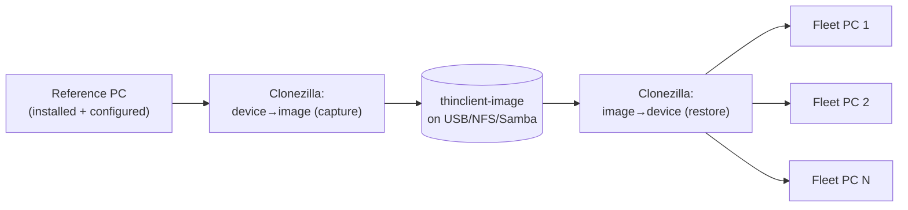

# Clonezilla fleet deployment

Once one **reference machine** is installed and configured
([DEPLOYMENT.md](DEPLOYMENT.md)), Clonezilla is the fastest way to roll it out to
tens or hundreds of identical machines.



## Prepare the reference machine

1. Install to disk (`thinclient-install`) and reboot from the internal disk.
2. Confirm it connects to the Windows server correctly.
3. **Neutralize machine-specific state** so clones don't collide:
   ```bash
   # In Admin Mode → (network/terminal), as root:
   rm -f /etc/machine-id && touch /etc/machine-id     # regenerated on next boot
   rm -f /var/lib/dbus/machine-id
   rm -f /etc/NetworkManager/system-connections/*      # optional: clear saved Wi-Fi
   truncate -s0 /var/log/thinclient/*.log
   ```
   The hostname is `thinclient` for all units by default; set a unique one per
   machine later if your monitoring needs it.
4. Shut down.

## Capture the image

1. Boot the reference PC from the **Clonezilla Live** USB.
2. Choose **device-image** → local device / SSH / Samba / NFS as the image store.
3. **savedisk** the whole disk (e.g. `sda`). Use the default `-q2` (partclone).
4. Give it a name, e.g. `thinclient-v1`.

Clonezilla only copies used blocks, so a ~4–6 GB appliance image is small and
fast.

## Restore to the fleet

Per machine:
1. Boot the target from Clonezilla Live.
2. **device-image** → **restoredisk** → pick `thinclient-v1` → target disk.

Or for many machines at once, use **Clonezilla SE (Server Edition)** with
multicast/PXE to image a whole lab in one shot.

### Post-restore checklist (per machine)
- First boot regenerates `machine-id` automatically.
- If a site uses a **different Windows server**, update it without re-imaging:
  Admin Mode → **Configure**, or edit `/etc/thinclient/server.conf`.
- If a machine has a different disk device name, GRUB was installed for both
  BIOS and UEFI so it should still boot; if not, re-run `thinclient-install`.

## Alternative: `dd` / raw clone

For a handful of identical-disk machines you can raw-clone:
```bash
# On a Linux box with both disks attached (DESTROYS the target):
dd if=/dev/sdSOURCE of=/dev/sdTARGET bs=64M status=progress conv=fsync
```
Clonezilla is preferred — it's block-aware, faster, and safer across slightly
different disk sizes.

## Updating the fleet later

- **Config-only change** (new server, toggle a device): edit `server.conf` — no
  re-image needed.
- **OS/package change**: rebuild the ISO, install to a fresh reference machine,
  re-capture, and re-deploy. Keep image versions (`thinclient-v1`, `-v2`, …).
