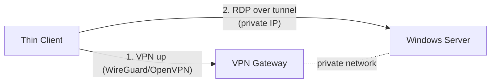

# Future: VPN integration (Phase 2)

Phase 1 is intentionally direct — the thin client speaks RDP straight to the
Windows server with no VPN, bastion, jump host, or gateway. This document
describes how to add a VPN layer later **without changing the user experience**.

## Goal

Remove direct internet exposure of RDP (TCP 3389). The client first establishes
a VPN tunnel, then connects to the server over the tunnel's private address.



## Where it plugs in

The boot flow gains one gated step **before** the reconnect loop starts
connecting:

```
thinclient-x.service → Openbox → [ VPN up + healthy ] → thinclient-session → RDP
```

Concretely:
1. Add a `thinclient-vpn.service` (`Before=thinclient-x.service`,
   `Wants=network-online.target`) that brings the tunnel up and blocks until it
   is healthy (interface up + can reach the server's private IP).
2. `thinclient-session` already re-reads config each attempt; point `SERVER_IP`
   at the **private** address. No launcher changes needed.
3. The watchdog gains an optional VPN-health check (tunnel down ⇒ splash +
   re-establish, still never a desktop).

## Recommended: WireGuard

Lightweight, fast, kernel-native in Debian 13.

- **Package:** `wireguard-tools` (add to a package list).
- **Config:** `/etc/wireguard/wg0.conf` (keys provisioned per device at build or
  first boot; treat as secrets like the RDP password).
- **Service:** enable `wg-quick@wg0`, and make `thinclient-x.service` depend on a
  small `thinclient-vpn-wait` unit that polls until the server's private IP is
  reachable.
- **New `server.conf` keys** (proposed): `VPN_ENABLED`, `VPN_TYPE=wireguard`,
  `VPN_ENDPOINT`, `VPN_HEALTHCHECK_IP` — parsed the same safe way as today.

Sketch:
```ini
# server.conf (phase 2 additions)
VPN_ENABLED=true
VPN_TYPE=wireguard
VPN_ENDPOINT=vpn.example.com:51820
SERVER_IP=10.44.0.10          # private address behind the tunnel
VPN_HEALTHCHECK_IP=10.44.0.1
```

## Alternative: OpenVPN

If the site standardizes on OpenVPN: `openvpn` + a `client.conf`, started by
`openvpn@client`, with the same "wait for tunnel, then connect" gating. Slightly
heavier and slower to establish than WireGuard.

## Health, recovery, and UX

- If the tunnel drops mid-session, FreeRDP loses the server and the existing
  reconnect loop shows *"Connecting…"* — the VPN service re-establishes
  underneath and the session resumes. **No desktop is ever shown**, consistent
  with Phase 1.
- Add tunnel status to `thinclient-diagnostics` and a "VPN" row to the Admin-Mode
  Diagnostics report.

## Security notes

- Provision unique keys per device; store them root-only (`0600`) like
  `admin.conf`. Rotate on decommission.
- With the VPN in place, the Windows firewall can drop all public 3389 traffic
  and accept RDP only from the VPN subnet — closing the main Phase-1 exposure
  discussed in [SECURITY.md](SECURITY.md).
- Consider certificate/pre-shared-key pinning and short DNS TTLs for the VPN
  endpoint.

## Migration path (no fleet re-image required for config)

1. Rebuild the ISO with `wireguard-tools` + the `thinclient-vpn` unit.
2. Roll it to the fleet via Clonezilla (OS change ⇒ new image version).
3. Per site, flip `VPN_ENABLED=true` and repoint `SERVER_IP` to the private
   address in `server.conf` — a config-only change thereafter.
