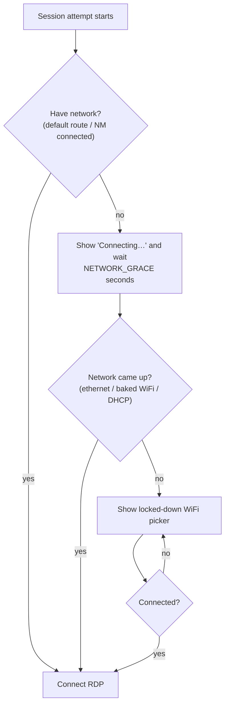

# Networking & WiFi

The thin client needs a network to reach the Windows RDP server. This is how it
gets one — automatically where possible, and with a locked-down on-screen WiFi
picker when it can't.

## Behavior at a glance

| Situation | What happens | User action |
|---|---|---|
| **Ethernet cable plugged in** | Auto-connects via DHCP | none |
| **Baked WiFi (`WIFI_SSID` set) in range** | Auto-joins on boot | none |
| **No network after `NETWORK_GRACE` (20s)** | **WiFi picker appears** | pick network + password |
| **WiFi password changed / moved to new site** | Goes offline → picker reappears | pick network + password |
| **Network restored** | Continues straight into RDP | none |

The user never reaches a Linux desktop in any of these cases.

## The boot-time network gate

Before each connection attempt, the session runs a **network gate**
(`thinclient-netwait`):



The grace window means a brief WiFi blip (NetworkManager auto-reconnects) never
pops the picker — it only appears on a genuine, sustained outage.

## The WiFi picker (`thinclient-wifi`)

When it appears, it shows a list of nearby WiFi networks (name, signal,
security). Pick one, enter the password if needed, and it connects — then the
session proceeds to RDP.

**It can only join WiFi.** There is no desktop, terminal, file manager, or
settings behind it. That is why it is safe to expose without a password: anyone
at the machine can reconnect it to WiFi, but they cannot reach anything else.

- **Rescan** re-scans for networks.
- Plugging in an **Ethernet cable** while the picker is open also satisfies the
  gate — the picker closes and RDP proceeds.
- A wrong password shows an error and returns to the list.

> Want WiFi changes to require a technician instead? Remove the network gate
> call from `thinclient-session` and rely on Admin Mode → Network. The picker
> access model is a deployment choice.

## Baking a default WiFi into the image

Set these in `server.conf` (or via Admin Mode → Configure) before building or on
a running unit:

```ini
WIFI_SSID=OfficeNet
WIFI_PSK=super-secret-passphrase
```

At first boot the machine generates a NetworkManager connection and auto-joins.
Every machine cloned from the image joins the same WiFi with zero interaction.
The picker still handles anything the baked network can't reach (a machine taken
to a different site, a changed password, etc.).

- Leave `WIFI_PSK` blank for an open network.
- Clear `WIFI_SSID` to remove the baked connection on the next boot.
- The passphrase is stored in the image (root-only, `0600`) — treat built images
  and installed disks as secrets. See [SECURITY.md](SECURITY.md).

## Static IP / advanced networking

For static IP, DNS, VLANs, or enterprise (802.1X) WiFi, use **Admin Mode →
Network** (`Ctrl+Alt+Shift+A`), which opens the full NetworkManager editor. CLI
equivalents are available via `thinclient-netctl`:

```bash
thinclient-netctl status                    # show interfaces / IPs / DNS
thinclient-netctl dhcp                       # switch active connection to DHCP
thinclient-netctl ip 10.0.0.20/24 10.0.0.1 1.1.1.1   # static IP/gw/dns
thinclient-netctl wifi "SSID" "passphrase"   # join a WiFi from the CLI
```

## Troubleshooting

- **Picker never appears, stuck on "Connecting…":** the box thinks it has a
  network (a default route exists) but can't reach the server. That's an RDP/
  firewall/server problem, not WiFi — see [TROUBLESHOOTING.md](TROUBLESHOOTING.md).
- **Picker shows no networks:** no WiFi adapter or driver. Confirm the adapter
  is supported (the image ships common firmware); use Ethernet meanwhile.
- **Connects then drops:** weak signal or wrong band. Check `thinclient-netctl
  status` in Admin Mode, or the `network.log`.
