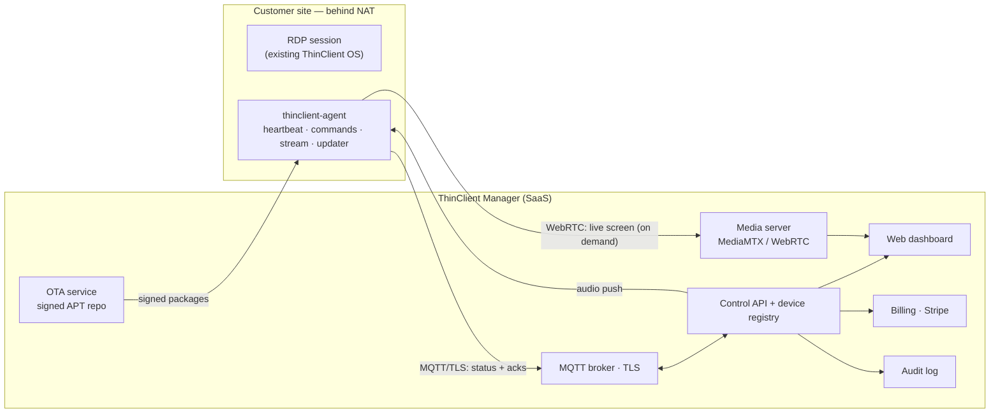

# ThinClient Manager — Platform Roadmap

The long-term product: a cloud **fleet-management platform** ("ThinClient Manager")
that turns the standalone ThinClient OS appliance into a centrally managed,
subscription-based fleet — think a focused mini-MDM for RDP thin clients.

This document is the north star; the work is tracked as GitHub issues grouped
into milestones **M1–M5** (+ cross-cutting Security & Compliance).

---

## Vision

From a single web console an operator can, for every deployed machine:

- **See it** — live inventory, health, version, who's online.
- **Control it** — shut down / reboot / lock, enable-disable USB, change its server.
- **Watch it** — on-demand live screen stream of the user's session.
- **Talk to it** — push an audio message that plays on the machine.
- **Patch it** — publish an update; machines auto-pull, verify, apply, and roll back on failure.
- **Bill it** — metered subscription at **$20 / device / month**.

---

## Architecture

Devices sit behind customer NAT/firewalls, so the agent always dials **outbound**
to the cloud over TLS — no inbound ports on the thin client.

### Proposed stack (adjust to team preference)

| Layer | Choice | Why |
|---|---|---|
| Device ↔ cloud control | **MQTT over TLS** (EMQX/Mosquitto) | Purpose-built for device C2: lightweight, pub/sub, offline queue, scales to thousands |
| Live video | **MediaMTX + WebRTC** | On-demand, low-latency, plays in the browser, no plugins |
| Backend | Node/TypeScript (or FastAPI) + **PostgreSQL** | Fast to build, strong ecosystem |
| Frontend | React dashboard | Fleet grid + live players |
| OTA (phase 1) | **Signed private APT repo** + versioned `thinclient-core` .deb | Debian-native, versioned, easy rollback |
| OTA (phase 2) | **RAUC / Mender A-B** | Atomic full-OS updates with guaranteed rollback |
| Auth | OIDC/JWT + **RBAC**, multi-tenant | SaaS isolation |
| Billing | **Stripe** metered ($20/device/mo) | Per-active-device |

---

## The on-device agent (`thinclient-agent`)

A new daemon added to the OS image, running as a hardened system service:

- Maintains the outbound MQTT/TLS session; auto-reconnects; queues telemetry offline.
- Publishes **heartbeat + telemetry** (online, OS/agent version, IP, current RDP target, CPU/RAM, uptime).
- Subscribes to a **per-device command topic**; every command is **signed** and **acked**, and written to the audit log.
- Executes commands through the *existing* scoped-sudo model (extended as needed): power, lock, USB policy, config sync, start/stop stream, play audio, apply update.

It reuses everything already built (config lib, scoped sudoers, systemd supervision) and adds the cloud control plane on top.

---

## Roadmap (milestones)

### M1 · Agent & Control Plane  *(foundation — build first)*
Enrollment & identity, heartbeat/telemetry, MQTT control channel, device registry
+ API, fleet-grid dashboard, **remote power (shutdown/reboot/restart)**, audit log.
Delivers the "see every machine + shut it down" core.

### M2 · Live Monitoring (video + audio)
On-demand screen streaming (agent ffmpeg → MediaMTX → WebRTC viewer), **audio
push/intercom**, and the on-screen "monitoring active" indicator + consent gate.

### M3 · Device Policy & Control
**USB enable/disable**, remote **lock/unlock** overlay, central `server.conf` sync,
broadcast on-screen messages/alerts.

### M4 · OTA Patch & Update
Package the appliance as a versioned `thinclient-core` .deb, a **signed** private
APT repo with release channels, the agent updater (pull → verify signature →
apply → health-check → **rollback on failure**), and **staged/canary rollout**
from the console. Phase-2: RAUC/Mender A-B atomic updates.

### M5 · SaaS, Billing & RBAC
Multi-tenant orgs, RBAC (owner/admin/operator/viewer), **Stripe billing at
$20/device/month**, entitlement enforcement with grace period, alerting.

### Cross-cutting · Security & Compliance  *(non-negotiable)*
mTLS device identity, **signed commands & signed updates**, secrets management,
per-tenant isolation, immutable audit trail, threat model + pen-test — and the
**privacy/consent/legal** framework for screen + audio monitoring.

---

## Business model

- **$20 / device / month**, metered on active (recently-online) devices.
- Zero software-license cost to you (open-source stack) → high gross margin.
- Natural tiers later: viewer-only vs full-control seats, retention length for
  recordings, support SLA.

---

## ⚠️ Security & legal — read before building

This platform is a **remote command-and-control system** with screen capture,
audio, USB control and remote shutdown. That power cuts both ways:

1. **If the control plane is breached, every deployed machine is owned.** Hence:
   per-device mTLS identity, cryptographically **signed** commands *and* updates,
   least-privilege on the device, strict RBAC, rate limits, and a complete audit
   log are requirements, not nice-to-haves.
2. **Screen + audio monitoring is legally sensitive.** It must be **transparent
   and consented** — a visible "monitoring active" indicator, a written policy the
   end-users acknowledge, defined data-retention limits, and access controls on
   recordings. Build it as an *overt administrative* capability, never covert
   surveillance. This protects your customer legally and protects the platform's
   reputation.

These are tracked as first-class issues, not afterthoughts.
