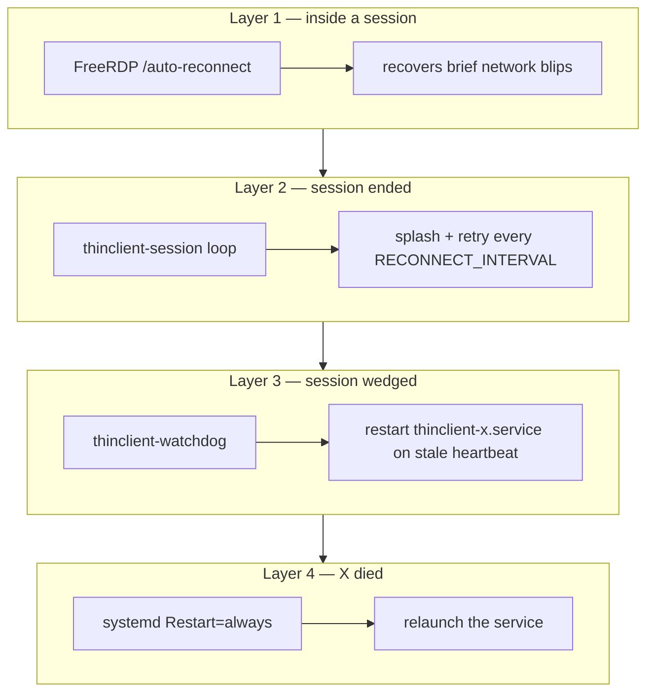

# Recovery & self-healing

The appliance is designed so that **no failure ever leaves Linux on screen**.
Recovery is layered — each layer catches what the one below it can't.



## Failure → response matrix

| Failure | Detected by | Response | User sees |
|---|---|---|---|
| Brief packet loss | FreeRDP | In-session auto-reconnect | Momentary freeze |
| Windows server reboots | `thinclient-session` | Splash, retry every `RECONNECT_INTERVAL` forever | "Connecting to Remote Workspace…" |
| User logs off in Windows | `thinclient-session` | Immediate reconnect | Brief splash |
| Network cable unplugged | `thinclient-session` | Retries; recovers when link returns | Splash until reconnected |
| Openbox / launcher hangs | `thinclient-watchdog` | `systemctl restart thinclient-x.service` after stale heartbeat (≤ ~15 s) | Brief splash |
| X server crashes | systemd | `Restart=always` relaunches within `RestartSec=2` | Brief splash |
| Config edited to a bad value | `tc_build_rdp_args` | Logs error, keeps retrying (no crash loop) | Splash + `rdp.log` entry |
| Crash-loop (RDP dies instantly) | `thinclient-session` | Honors `RECONNECT_INTERVAL` backoff; `StartLimitBurst` guards systemd | Splash |

## The heartbeat

`thinclient-session` writes `/run/thinclient/heartbeat` (epoch seconds) both while
connected **and** while waiting to reconnect. The watchdog judges health from the
heartbeat's *age*, not from "is xfreerdp running?" — so it never fights the
launcher's intentional reconnect pauses, yet still catches a genuinely wedged
session. Threshold: `3 × WATCHDOG_INTERVAL` (min 15 s).

Runtime state is also exposed in `/run/thinclient/state`
(`BOOT`/`CONNECTING`/`CONNECTED`/`DISCONNECTED`/`STOPPING`).

## If `AUTO_RECONNECT=false`

The session does **not** drop to a desktop. It holds on a splash reading
*"Session ended. Reconnecting is disabled."* until an admin intervenes.

## Manual recovery (admin)

```bash
# Force an immediate reconnect
systemctl restart thinclient-x.service

# Watch what the watchdog is doing
tail -f /var/log/thinclient/watchdog.log

# Inspect the last RDP attempt
tail -n 50 /var/log/thinclient/rdp.log

# Full health snapshot
/opt/thinclient/bin/thinclient-diagnostics
```

## Worst case: unbootable machine

If the internal disk is corrupted, boot the ThinClient USB (live), then re-run
`sudo thinclient-install /dev/sda` to reimage the disk, or restore the Clonezilla
image. Config is trivially re-applied via Admin Mode afterward.

See [TROUBLESHOOTING.md](TROUBLESHOOTING.md) for symptom-driven fixes.
